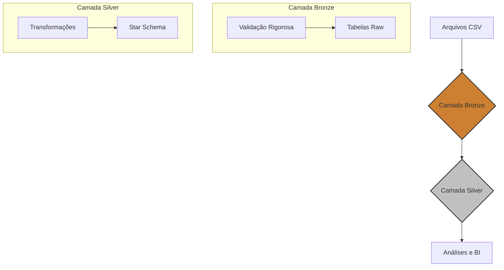

# Credits Brasil - Data Warehouse (v4.1)

Pipeline ETL moderno para consolidação de dados financeiros, implementando uma arquitetura Medallion (Bronze e Silver) com um modelo dimensional Star Schema e um sistema rigoroso de validação de dados na camada de entrada.

**Versão:** 4.1 (Novembro de 2025 - Padronização CNPJ/CPF e Melhorias Gerais)

## 📋 Sumário

1.  [Visão Geral e Arquitetura](#-visão-geral-e-arquitetura)
2.  [Principais Melhorias (v4.0)](#-principais-melhorias-v40)
3.  [Tecnologias](#-tecnologias)
4.  [Configuração e Instalação](#-configuração-e-instalação)
5.  [Executando o Pipeline](#-executando-o-pipeline)
6.  [Validação de Dados e Logs](#-validação-de-dados-e-logs)
7.  [Estrutura do Projeto](#-estrutura-do-projeto)
8.  [Desenvolvimento e Contribuição](#-desenvolvimento-e-contribuição)

---

## 🏛️ Visão Geral e Arquitetura

Este projeto implementa um Data Warehouse para centralizar dados de clientes, usuários e faturamento da Credits Brasil. O objetivo é fornecer uma fonte de dados confiável, consolidada e otimizada para análises estratégicas e Business Intelligence.

A arquitetura segue o padrão **Medallion**, com um fluxo de dados claro entre as camadas:



### Camadas de Dados

#### 🥉 Camada Bronze (`schema: bronze`)

-   **Propósito:** Armazenar os dados brutos exatamente como vêm da origem, mas **apenas após passarem por uma validação rigorosa**.
-   **Estratégia:** `TRUNCATE/RELOAD`. A cada execução, a tabela é limpa e recarregada com os dados da nova carga.
-   **Validação (v4.0):** Este é o principal diferencial. Nenhum dado inválido entra na camada Bronze. Registros que falham nas regras de validação (formato, tipo, obrigatoriedade, domínio) são **rejeitados** e registrados na tabela `credits.logs_rejeicao` para análise, garantindo 100% de qualidade na entrada.

#### 🥈 Camada Silver (`schema: silver`)

-   **Propósito:** Modelar os dados para análise, aplicando regras de negócio, limpando, enriquecendo e criando um modelo dimensional.
-   **Estratégia:** Cargas incrementais e **SCD Type 2 (Slowly Changing Dimensions)** para dimensões que precisam de histórico de mudanças (ex: `dim_clientes`, `dim_usuarios`).
-   **Modelo:** **Star Schema**, composto por tabelas Fato (métricas de negócio) e Dimensões (contexto descritivo), otimizado para consultas analíticas.

---

## 🎯 Características Principais

-   **Validação Rigorosa:** Sistema completo de validação na camada Bronze com logs detalhados de rejeições
-   **Padronização de Dados:** CNPJ/CPF formatados automaticamente (limpo + formatado)
-   **SCD Type 2:** Histórico de mudanças em dimensões críticas (clientes e usuários)
-   **Star Schema:** Modelo dimensional otimizado para análises e BI
-   **Auditoria Completa:** Rastreamento de todas as execuções e rejeições
-   **Docker:** Ambiente completamente containerizado para fácil deployment

---

## 🛠️ Tecnologias

| Componente        | Tecnologia        |
| ----------------- | ----------------- |
| **Linguagem**     | Python 3.10+      |
| **Banco de Dados**| PostgreSQL 15     |
| **Containerização**| Docker & Compose  |
| **Processamento** | Pandas, NumPy     |
| **Conexão DB**    | psycopg2-binary   |
| **Logs**          | Loguru            |
| **Qualidade**     | Black, Ruff, Mypy |
| **Testes**        | Pytest, Pytest-Cov|

---

## ⚙️ Configuração e Instalação

### Pré-requisitos

-   Docker e Docker Compose instalados.
-   Git para clonar o repositório.
-   Acesso à internet para baixar a imagem Docker e dependências.

### 1. Clonar o Repositório

```bash
git clone https://github.com/brunocredits/credits-dw.git
cd credits-dw
```

### 2. Configurar Variáveis de Ambiente

Crie o arquivo `.env` na raiz do projeto a partir do template. Este arquivo **não é versionado** por segurança.

```bash
cp .env.example .env
```

Edite o arquivo `.env` com as credenciais do seu banco de dados:

```properties
DB_HOST=seu_host_banco
DB_PORT=5432
DB_NAME=seu_db
DB_USER=seu_usuario
DB_PASSWORD=sua_senha
LOG_LEVEL=INFO
```

### 3. Preparar Arquivos CSV de Entrada

Coloque os arquivos CSV que serão processados no diretório `docker/data/input/onedrive/`. A estrutura esperada é:

```
docker/data/input/onedrive/
├── contas_base_oficial.csv
├── usuarios.csv
└── faturamento.csv
```

---

## 🚀 Executando o Pipeline

Todo o ambiente é orquestrado pelo Docker. Os comandos devem ser executados a partir do diretório raiz do projeto.

### 1. Iniciar o Ambiente Docker

Este comando irá construir a imagem Docker, baixar as dependências e iniciar o container do serviço de ETL em background.

```bash
docker compose -f docker/docker-compose.yml up -d --build
```

Para verificar se o container está em execução:

```bash
docker compose -f docker/docker-compose.yml ps
# Deve exibir o serviço etl-processor com status "running"
```

### 2. Executar a Ingestão (Camada Bronze)

Este script executa todos os ingestores de CSV configurados, realizando o processo de validação, rejeição e carga na camada Bronze.

```bash
docker compose -f docker/docker-compose.yml exec etl-processor python python/run_all_ingestors.py
```

**Para executar um ingestor específico:**

```bash
# Exemplo para o faturamento
docker compose -f docker/docker-compose.yml exec etl-processor python python/ingestors/csv/ingest_faturamento.py
```

### 3. Executar as Transformações (Camada Silver)

Após a carga da Bronze, este script executa as transformações para popular as dimensões e fatos da camada Silver.

```bash
docker compose -f docker/docker-compose.yml exec etl-processor python python/run_silver_transformations.py
```

### 4. Parar o Ambiente

Para desligar os containers, utilize:

```bash
docker compose -f docker/docker-compose.yml down
```

---

## 📊 Validação de Dados e Logs

### Logs de Execução

-   Cada script gera um arquivo de log em `/app/logs/` dentro do container (mapeado para a pasta `logs/` no host).
-   Você pode acompanhar um log em tempo real:
    ```bash
    # Exemplo para o ingestor de faturamento
    docker compose -f docker/docker-compose.yml exec etl-processor tail -f /app/logs/ingest_faturamento.py.log
    ```

### Logs de Rejeição (A Jóia da Coroa da v4.0)

-   Quando um registro de um CSV falha na validação, ele é **rejeitado** e um log detalhado é inserido na tabela `credits.logs_rejeicao`.
-   Isso permite uma análise precisa dos problemas de qualidade na origem.

**Para consultar os registros rejeitados:**

```sql
-- Resumo de rejeições do último dia por motivo
SELECT
    script_nome,
    campo_falha,
    motivo_rejeicao,
    COUNT(1) as total_rejeicoes
FROM credits.logs_rejeicao
WHERE data_rejeicao >= NOW() - INTERVAL '1 day'
GROUP BY 1, 2, 3
ORDER BY total_rejeicoes DESC;

-- Detalhes de um registro rejeitado
SELECT
    numero_linha,
    valor_recebido,
    registro_completo::jsonb
FROM credits.logs_rejeicao
WHERE id = <id_da_rejeicao>;
```

---

## 🏗️ Estrutura do Projeto

```
credits-dw/
│
├── docker/
│   ├── Dockerfile              # Define a imagem Python do ETL
│   ├── docker-compose.yml      # Orquestra os serviços Docker
│   └── data/                   # Volume de dados (input, processed)
│
├── python/
│   ├── ingestors/              # Scripts de ingestão (Camada Bronze)
│   │   └── csv/
│   │       ├── base_csv_ingestor.py  # Classe base com Template Method
│   │       └── ingest_*.py           # Ingestores específicos
│   │
│   ├── transformers/           # Scripts de transformação (Camada Silver)
│   │   └── silver/
│   │       ├── transform_*.py      # Transformadores para dims e fatos
│   │
│   ├── utils/                    # Módulos de utilidade
│   │   ├── audit.py              # Logs de auditoria de execução
│   │   ├── config.py             # Carregamento de configurações
│   │   ├── db_connection.py      # Gerenciamento de conexão com o DB
│   │   ├── logger.py             # Configuração do Loguru
│   │   ├── rejection_logger.py   # Sistema de log de rejeições (NOVO)
│   │   └── validators.py         # Funções de validação de dados (NOVO)
│   │
│   ├── run_all_ingestors.py      # Orquestrador da camada Bronze
│   └── run_silver_transformations.py # Orquestrador da camada Silver
│
├── logs/                       # Arquivos de log gerados pelas execuções
├── tests/                      # Testes unitários e de integração
├── .env.example                # Arquivo de exemplo para variáveis de ambiente
├── requirements.txt            # Dependências Python
└── README.md                   # Este arquivo
```

---

## 🧑‍💻 Desenvolvimento e Contribuição

### Adicionando um Novo Ingestor (Bronze)

1.  Crie o arquivo em `python/ingestors/csv/ingest_novo_arquivo.py`.
2.  Crie uma classe que herde de `BaseCSVIngestor`.
3.  Implemente os 3 métodos obrigatórios:
    -   `get_column_mapping()`: Mapeia colunas do CSV para a tabela.
    -   `get_bronze_columns()`: Lista as colunas da tabela Bronze.
    -   `get_validation_rules()`: Define as regras de validação para cada campo.
4.  Adicione o novo ingestor ao `run_all_ingestors.py`.

**Exemplo de `get_validation_rules()`:**

```python
def get_validation_rules(self) -> Dict[str, dict]:
    return {
        'email': {
            'obrigatorio': True,
            'tipo': 'email'
        },
        'receita': {
            'obrigatorio': True,
            'tipo': 'decimal',
            'positivo': True # Deve ser um número > 0
        },
        'moeda': {
            'obrigatorio': True,
            'tipo': 'string',
            'dominio': ['BRL', 'USD', 'EUR'] # Apenas valores permitidos
        }
    }
```

### Ferramentas de Qualidade de Código

Antes de commitar, rode as ferramentas de qualidade:

```bash
# Formatação de código
black python/ tests/

# Análise de estilo e erros (Linter)
ruff check .

# Verificação de tipos estáticos
mypy python/
```

### Executando Testes

Para garantir que nenhuma funcionalidade foi quebrada:

```bash
# Executar todos os testes
pytest

# Executar com relatório de cobertura de código
pytest --cov=python
```