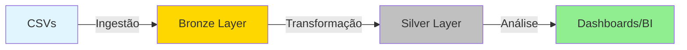
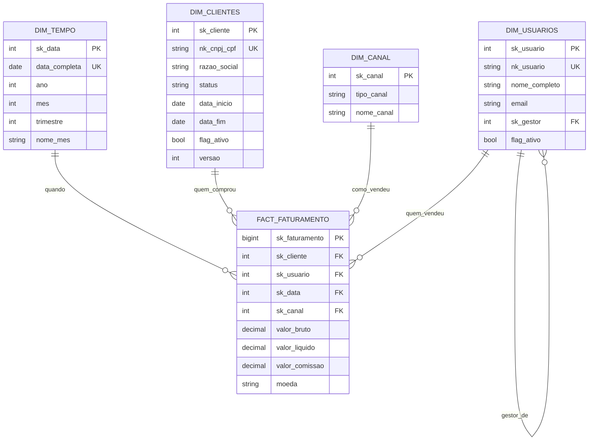
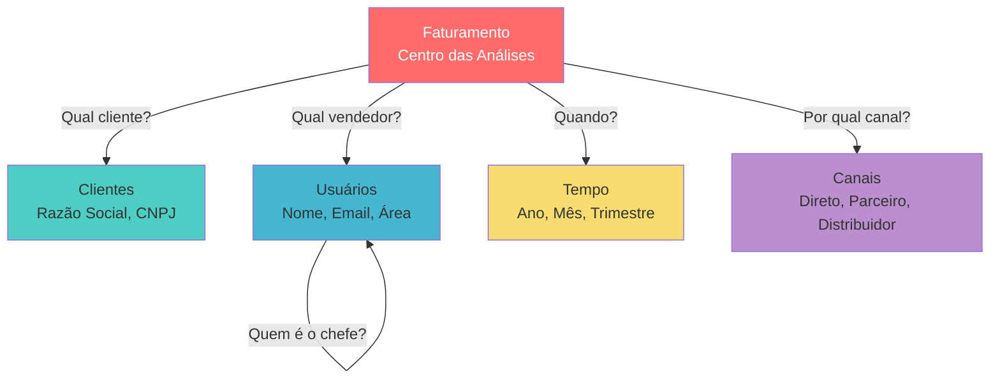

# 🏦 Credits Brasil - Data Warehouse

Sistema de Data Warehouse para consolidar e organizar dados financeiros da Credits Brasil, permitindo análises estratégicas e relatórios gerenciais.

## 📊 O Que Faz Este Projeto

Imagine que você tem dados espalhados em vários arquivos CSV (planilhas) vindos de diferentes sistemas:
- **Clientes** cadastrados
- **Usuários** da equipe
- **Faturamento** diário

Este projeto:
1. **Coleta** esses arquivos CSV
2. **Organiza** os dados em um banco de dados estruturado
3. **Enriquece** com regras de negócio e cálculos
4. **Prepara** para análises e dashboards

## 🏗️ Como Funciona (Arquitetura)

O projeto usa a arquitetura **Medallion** com duas camadas:

### Camada Bronze 🥉 (Dados Brutos)
Guarda os dados originais dos CSVs com mínima transformação.

**O que tem:**
- 4 clientes cadastrados
- 4 usuários da equipe
- 8 transações de faturamento
- 1 calendário pré-calculado (4.018 datas)

### Camada Silver 🥈 (Dados Organizados)
Transforma os dados brutos em um modelo dimensional (Star Schema) pronto para análises.



## 📐 Modelo de Dados (Silver Layer)

### Diagrama de Relacionamentos



### Como os Dados se Relacionam



## 💡 Conceitos Importantes (Simplificado)

### 1. Star Schema (Esquema Estrela)
É como organizar dados em formato de estrela ⭐:
- **Centro (Fato):** Números que você quer somar/analisar (ex: valor de vendas)
- **Pontas (Dimensões):** Contexto da análise (quem, quando, onde, como)

**Vantagem:** Queries SQL mais simples e rápidas!

### 2. SCD Type 2 (Histórico de Mudanças)
Guarda o histórico quando algo muda. Exemplo:

**Cliente mudou de status:**
```
Versão 1: Status = "ATIVO"    | 2024-01-01 até 2024-06-30
Versão 2: Status = "INATIVO"  | 2024-07-01 até hoje
```

**Vantagem:** Você pode fazer análises tipo "quantos clientes eram ativos em março?"

### 3. Chaves Substitutas (Surrogate Keys)
Ao invés de usar CNPJ/CPF diretamente, usamos IDs numéricos (sk_cliente, sk_data).

**Vantagens:**
- Mais rápido (número é mais rápido que texto)
- Permite múltiplas versões do mesmo cliente (histórico)
- Não muda se CNPJ corrigir erro de digitação

## 🚀 Como Usar

### Pré-requisitos
- Docker instalado
- Acesso ao banco PostgreSQL (Azure)

### 1. Configurar

```bash
# Clonar projeto
git clone https://github.com/brunocredits/credits-dw.git
cd credits-dw

# Configurar credenciais do banco
cp .env.example .env
# Edite o .env com suas credenciais
```

### 2. Iniciar Container

```bash
cd docker
docker compose up -d --build
```

### 3. Carregar Dados do Bronze (CSVs → Banco)

```bash
# Coloque seus CSVs em: docker/data/input/onedrive/
# Depois execute:
docker compose exec etl-processor python python/run_all_ingestors.py
```

### 4. Transformar para Silver (Bronze → Silver)

```bash
docker compose exec etl-processor python python/run_silver_transformations.py
```

## 📊 Exemplos de Análises (SQL)

### Faturamento por Mês
```sql
SELECT
    t.ano,
    t.mes,
    t.nome_mes,
    SUM(f.valor_liquido) as receita_total,
    COUNT(DISTINCT f.sk_cliente) as clientes_ativos
FROM silver.fact_faturamento f
JOIN silver.dim_tempo t ON f.sk_data = t.sk_data
WHERE t.ano = 2024
GROUP BY t.ano, t.mes, t.nome_mes
ORDER BY t.mes;
```

### Top 5 Clientes por Faturamento
```sql
SELECT
    c.razao_social,
    c.grupo,
    SUM(f.valor_liquido) as total_comprado
FROM silver.fact_faturamento f
JOIN silver.dim_clientes c ON f.sk_cliente = c.sk_cliente
WHERE c.flag_ativo = true
GROUP BY c.razao_social, c.grupo
ORDER BY total_comprado DESC
LIMIT 5;
```

### Performance por Canal de Vendas
```sql
SELECT
    ca.tipo_canal,
    ca.nome_canal,
    COUNT(*) as num_vendas,
    SUM(f.valor_bruto) as receita_bruta,
    SUM(f.valor_comissao) as comissao_paga
FROM silver.fact_faturamento f
JOIN silver.dim_canal ca ON f.sk_canal = ca.sk_canal
GROUP BY ca.tipo_canal, ca.nome_canal
ORDER BY receita_bruta DESC;
```

## 📂 Estrutura do Projeto

```
credits-dw/
├── docker/
│   ├── Dockerfile              # Container Python
│   ├── docker-compose.yml      # Orquestração
│   └── data/
│       ├── input/onedrive/     # Coloque CSVs aqui
│       └── processed/          # CSVs já processados
│
├── python/
│   ├── ingestors/csv/          # Scripts Bronze (CSV → Banco)
│   ├── transformers/silver/    # Scripts Silver (Bronze → Silver)
│   ├── utils/                  # Funções auxiliares
│   ├── run_all_ingestors.py    # Executar todos ingestores
│   └── run_silver_transformations.py  # Executar transformações
│
├── .env.example                # Template de configuração
├── requirements.txt            # Dependências Python
└── README.md                   # Este arquivo
```

## 📈 Status Atual

| Camada | Tabelas | Registros | Status |
|--------|---------|-----------|--------|
| **Bronze** | 4 tabelas | 4 clientes<br/>4 usuários<br/>8 transações<br/>4.018 datas | ✅ Operacional |
| **Silver** | 5 tabelas | dim_tempo: 4.018<br/>dim_canal: 7<br/>Outros: 0 | ⚠️ Aguardando execução de transformers |

## 🎯 Próximos Passos

1. ✅ ~~Estrutura do banco criada~~
2. ✅ ~~Scripts de ingestão prontos~~
3. ✅ ~~Scripts de transformação implementados~~
4. ✅ ~~Dados de exemplo criados (4+4+8 registros)~~
5. ⬜ Executar transformers para popular Silver
6. ⬜ Validar dados transformados
7. ⬜ Conectar ferramenta de BI (Power BI, Metabase, etc)

## 🛡️ Segurança e Permissões

O banco tem 3 níveis de acesso:

| Perfil | Pode Fazer | Uso |
|--------|------------|-----|
| **Reader** | Apenas ler dados | Analistas, BI |
| **Developer** | Ler e modificar | Desenvolvedores, Testes |
| **Admin** | Tudo (incluir limpar tabelas) | DBA, ETL |

## 🐛 Problemas Comuns

**Container não inicia?**
```bash
docker compose logs etl-processor
docker compose down && docker compose up -d --build
```

**Erro de conexão ao banco?**
- Verifique se o `.env` está configurado
- Confirme que o IP tem acesso ao Azure PostgreSQL (Firewall)

**Transformação falha?**
```bash
# Ver logs detalhados
docker compose exec etl-processor tail -f /app/logs/*.log
```

## 📚 Documentação Técnica

Para detalhes técnicos avançados, consulte:
- **[CLAUDE.md](./CLAUDE.md)** - Guia completo para desenvolvedores

---

## 📖 Glossário Rápido

- **ETL**: Extract, Transform, Load (Extrair, Transformar, Carregar)
- **Bronze Layer**: Camada de dados brutos
- **Silver Layer**: Camada de dados organizados
- **Star Schema**: Modelo dimensional em formato de estrela
- **Fact Table**: Tabela de fatos (métricas numéricas)
- **Dimension Table**: Tabela de dimensões (contexto)
- **SCD Type 2**: Estratégia para guardar histórico de mudanças
- **Surrogate Key**: Chave artificial (ID numérico) ao invés de chave natural (CNPJ, CPF)

---

<div align="center">

**Desenvolvido pela Equipe de Engenharia de Dados - Credits Brasil**

[](https://www.python.org/)
[](https://www.postgresql.org/)
[](https://www.docker.com/)

</div>
